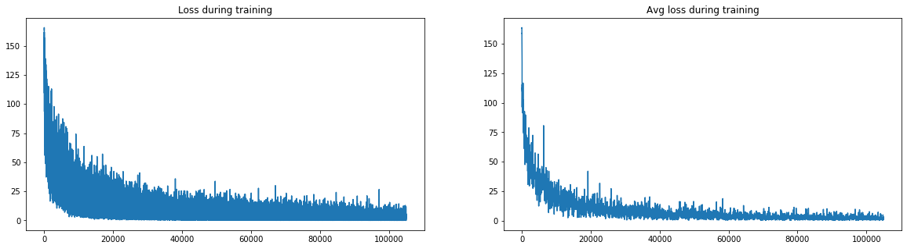
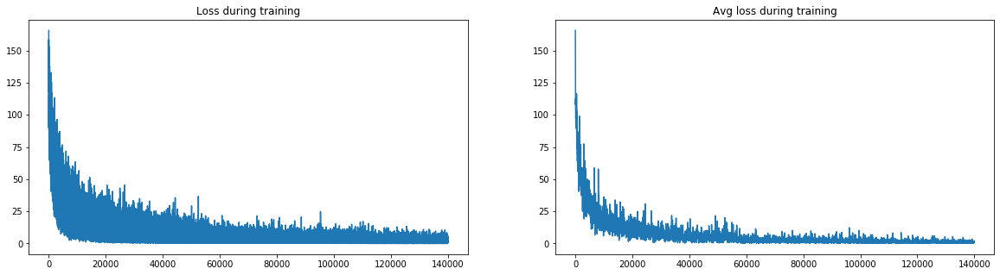

This repo is the implementation of [GENERALIZED END-TO-END LOSS FOR SPEAKER VERIFICATION](https://arxiv.org/pdf/1710.10467.pdf) using Pytorch including both Text Dependent and Text Independent Speaker Verification. 


When implementing the code, I refer two existing repo: [Speaker_Verification](https://github.com/Janghyun1230/Speaker_Verification) and [PyTorch_Speaker_Verification](https://github.com/HarryVolek/PyTorch_Speaker_Verification). While first one is using tensorflow and second one only implements TI-SV.


There are two datasets I used in my repo:

- For TD-SV, I use **[keyword-spotting-research-datasets](https://github.com/snipsco/keyword-spotting-research-datasets)** key word dataset. Because there are less than 10 utterances for each speaker, I add noise and stretch audio to do data argumentation.
- For TI-SV, I use similar [TIMIT](https://catalog.ldc.upenn.edu/LDC93S1). Attention, WAV file in TIMIT need use sphfile to transform in order to work. Please see [reading a WAV file from TIMIT database in python](https://stackoverflow.com/questions/44748258/reading-a-wav-file-from-timit-database-in-python)for details.
- There are data preprocessing code inside data folder.


Compare ERR result:

|           | TD-SV   | TI-SV   |
| --------- | ------- | ------- |
| Paper     | 0.031   | 0.406   |
| Const_lr  | 0.02408 | 0.04112 |
| Step_lr   | 0.02425 | 0.03979 |
| Other_git |         | 0.05742 |


The following is experiment analysis for TD-SV and TI-SV.

```python
import torch
import numpy
import matplotlib.pyplot as plt
```

# const learning rate with 1500 epochs

## TD-SV

### TD-SV Loss


```python
loss_log_tdsv = torch.load('./log_const_lr/tdsv/loss.log')
```


```python
fig, axes = plt.subplots(1, 2, figsize=(20, 5))
axes[0].plot(loss_log_tisv['loss'])
axes[1].plot(loss_log_tisv['total_loss'])

axes[0].set_title("Loss during training")
axes[1].set_title("Avg loss during training")

print("Final Loss: {}; Avg loss: {}".format(loss_log_tisv['loss'][-1], loss_log_tisv['total_loss'][-1]))
```

    Final Loss: 1.35565185546875; Avg loss: 1.268243408203125


### TD-SV ERR


```python
EER_log_tdsv = torch.load('./log_const_lr/EER/tdsv/EER.eer')
print("Avg EER for TD-SV is {}".format(EER_log_tdsv["avg_EER_log"][-1]))
```

    Avg EER for TD-SV is 0.02408068842832344


## TI-SV

### TI-SV Loss


```python
loss_log_tisv = torch.load('./log_const_lr/tisv/loss.log')
```


```python
fig, axes = plt.subplots(1, 2, figsize=(20, 5))
axes[0].plot(loss_log_tisv['loss'])
axes[1].plot(loss_log_tisv['total_loss'])

axes[0].set_title("Loss during training")
axes[1].set_title("Avg loss during training")

print("Final Loss: {}; Avg loss: {}".format(loss_log_tdsv['loss'][-1], loss_log_tdsv['total_loss'][-1]))
```

    Final Loss: 1.3204524517059326; Avg loss: 2.5933795539700255


### TI-SV EER


```python
EER_log_tisv = torch.load('./log_const_lr/EER/tisv/EER.eer')
print("Avg EER for TI-SV is {}".format(EER_log_tisv["avg_EER_log"][-1]))
```

    Avg EER for TI-SV is 0.04112244994945027


# Step learning rate with 2000 epochs

Decrease lr to half every 800 epochs

## TD-SV

### TD-SV Loss


```python
loss_log_tdsv = torch.load('./log/loss/tdsv/loss.loss')
```


```python
fig, axes = plt.subplots(1, 2, figsize=(20, 5))
axes[0].plot(loss_log_tisv['loss'])
axes[1].plot(loss_log_tisv['total_loss'])

axes[0].set_title("Loss during training")
axes[1].set_title("Avg loss during training")

print("Final Loss: {}; Avg loss: {}".format(loss_log_tisv['loss'][-1], loss_log_tisv['total_loss'][-1]))
```

    Final Loss: 0.2689208984375; Avg loss: 2.120063999720982





### TD-SV ERR


```python
EER_log_tdsv = torch.load('./log/EER_final_model/tdsv/EER.eer')
print("Avg EER for TD-SV using final model is {}".format(EER_log_tdsv["avg_EER_log"][-1]))
```

    Avg EER for TD-SV using final model is 0.024537037641965544


```python
EER_log_tdsv = torch.load('./log/EER_optim_model/tdsv/EER.eer')
print("Avg EER for TD-SV using optim model is {}".format(EER_log_tdsv["avg_EER_log"][-1]))
```

    Avg EER for TD-SV using optim model is 0.02425264612323156


## TI-SV

### TI-SV Loss


```python
loss_log_tisv = torch.load('./log/loss/tisv/loss.loss')
```


```python
fig, axes = plt.subplots(1, 2, figsize=(20, 5))
axes[0].plot(loss_log_tisv['loss'])
axes[1].plot(loss_log_tisv['total_loss'])

axes[0].set_title("Loss during training")
axes[1].set_title("Avg loss during training")

print("Final Loss: {}; Avg loss: {}".format(loss_log_tdsv['loss'][-1], loss_log_tdsv['total_loss'][-1]))
```

    Final Loss: 1.9604518413543701; Avg loss: 2.488234414859694





### TI-SV EER


```python
EER_log_tisv = torch.load('./log/EER_final_model/tisv/EER.eer')
print("Avg EER for TI-SV using final model is {}".format(EER_log_tisv["avg_EER_log"][-1]))
```

    Avg EER for TI-SV using final model is 0.03900510319009689


```python
EER_log_tisv = torch.load('./log/EER_optim_model/tisv/EER.eer')
print("Avg EER for TI-SV using optim model is {}".format(EER_log_tisv["avg_EER_log"][-1]))
```

    Avg EER for TI-SV using optim model is 0.03979591946450196


# Other available replication in Github
Only TI-SV is implemented in their repo.


```python
EER_log_tisv = torch.load('./checkpoint_git/EER/tisv/EER.eer')
print("Avg EER for TI-SV is {}".format(EER_log_tisv["avg_EER_log"][-1]))
```

    Avg EER for TI-SV is 0.05742347076801317
